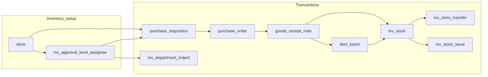

# Inventory transactions and batch flow (Heka)

## When to load this skill

- Adding or changing **purchase requisition**, **purchase order**, **GRN**, **stock**, **transfer**, **issue**, **department consumption**, or **approval configuration** behavior.
- Touching **`item_batch`**, **`inv_stock`**, **`goods_receipt_line`**, or **`item_master.is_batch_required`**.
- Writing migrations or seeds that affect inventory tables or **`status_tagging`** IDs for inventory document types.
- Mirroring new **SvelteKit routes** under `home/inventory` or `home/inventory-setup` per project rules.

## Project conventions (do not bypass)

- **Data path**: [`.cursor/rules/remote-api-pages-flow.mdc`](../../rules/remote-api-pages-flow.mdc) — `+page.svelte` → mirrored `+server.ts` → `$lib/server/heka/...` modules; UI types in `$lib/model/type`, not raw Drizzle types in components ([`.cursor/rules/app-development.mdc`](../../rules/app-development.mdc)).
- **AuthZ**: Every server entrypoint uses **`ensureCanAccessHospital`** (or inventory helpers that call it) with `hospital_id` from the route.
- **Workflow states**: Document lifecycle uses **`status_tagging`** + **`status_tagging_type`**, not ad-hoc status tables. Inventory type IDs and per-flow status IDs are mirrored in [`src/lib/model/enum/db-link.ts`](../../../src/lib/model/enum/db-link.ts) (`StatusTaggingTypeEnum`, `InvPrStatusTaggingEnum`, `InvPoStatusTaggingEnum`, `InvGrnStatusTaggingEnum`, etc.). **Any change to seeded IDs requires the same change in `db-link.ts`.**
- **Seeds**: [`src/lib/server/db/seed/information-table-seed.ts`](../../../src/lib/server/db/seed/information-table-seed.ts) includes inventory **`status_tagging_type` / `status_tagging`** (including **Department indent**, type id **8**, status ids **40–45**; **Department consumption**, type id **10**, status ids **50–53** per **`0050`**) and, in **section 7b**, idempotent **`inv_approval_level` / `inv_approval_log`** DDL: module **`CHECK`** aligned with migrations up through **`0051`** (**`GRN`**, **`DC`**) and the **partial unique** index from **0041**, so `pnpm db:seed` can fix approval schema when full `db:migrate` was not run (requires `inv_approval_level` to exist from an earlier migration or `db:push`).

## End-to-end business flow

1. **Approval configuration** (per hospital + store + **`module`** on `inv_approval_level`): codes are defined in [`src/lib/model/type/heka/inv-approval.type.ts`](../../../src/lib/model/type/heka/inv-approval.type.ts) as **`PR` | `PO` | `DI` | `GRN` | `DC`** (`INV_APPROVAL_MODULE_CODES`). UI: **Inventory Setup → Approval configuration** — each module has its own levels/assignees. **Wired in server today:** PR, PO, department indent (**`DI`**), department consumption (**`DC`**). **`GRN`** is used as a permission-style assignment check in some flows. `inv_approval_log` records actions (`InvApprovalActionEnum`). **Schema:** `inv_approval_level.module` and `inv_approval_log.module` are enforced with a DB `CHECK`; **partial unique index** on `(hospital_id, store_id, module, level) WHERE deleted_at IS NULL` so a level can be re-added after soft-delete. [`approval-config.server.ts`](../../../src/lib/server/heka/inventory/approval-config.server.ts) revives a soft-deleted row when recreating the same level instead of inserting a duplicate key.
2. **PR**: `purchase_requisition` has **`from_store_id`** and **`to_store_id`** (same branch, must differ) + lines; PR approvals use **`from_store_id`**. Optional line qty adjustments on approve.
3. **PO**: From an **approved** PR (allocates from PR line `qty_remaining`): `purchase_order.store_id` = PR **`to_store_id`** (central purchasing / destination), not `from_store_id`; `pr_id` set (`createPurchaseOrder`). **Manual PO** (`createPurchaseOrderDirect`): `pr_id` null, `store_id` must be the central purchasing store. Both paths live in [`po.server.ts`](../../../src/lib/server/heka/inventory/po.server.ts).
4. **GRN**: **PO-backed**: `goods_receipt_note.po_id` set; receipt **`store_id`** must equal the PR’s **`to_store_id`** when `pr_id` is present, or the PO’s **`store_id`** for manual POs. **Direct GRN** (no PO): `po_id` null, `supplier_id` + lines with `po_line_id` null — `createAndPostDirectGoodsReceipt` in [`grn.server.ts`](../../../src/lib/server/heka/inventory/grn.server.ts). Each line creates/links **`item_batch`**, and **`inv_stock.quantity` is in issue units** (via [`item-unit-inventory.server.ts`](../../../src/lib/server/heka/inventory/item-unit-inventory.server.ts)).
5. **UI — From store (navbar)**: On routes under `/heka/hospital/{id}/home/inventory` (not `inventory-setup`), the top bar can show a **From store** selector (cookie `heka_selected_inventory_from_store_id`, POST `set-selected-inventory-from-store`). PR create and manual PO / direct GRN default to this store where applicable. **Department consumption — New** (`inventory/department-consumption/new`): **`store_id` is fixed to that navbar From store** (readonly display); submit stays disabled until a store is selected, matching **department indent / New** “From store” behavior.
6. **Stock listing**: Aggregates from `inv_stock` (quantities in **issue units**); display joins default `item_unit_master` for the issue unit name. Lot view joins `item_batch`. **FEFO** = order by `item_batch.expiry_date ASC NULLS LAST`.
7. **Transfer**: Lines are **batch-scoped**: `{ itemId, batchId, quantity, unitId }`; moves quantity between stores for the same `batch_id`.
8. **Issue**: Lines may omit **`batchId`** → auto **FEFO** across `inv_stock` rows for that item in the store; or set **`batchId`** for a single-batch deduction. Multiple `inv_stock_issue_line` rows may be inserted when FEFO spans batches.

## Schema locations

| Area | Drizzle file |
|------|----------------|
| PR/PO/GRN, approval, `item_batch`, `inv_stock`, transfer, issue | [`src/lib/server/db/table/information-table/inventory-transaction-table.ts`](../../../src/lib/server/db/table/information-table/inventory-transaction-table.ts) |
| Relations | [`src/lib/server/db/table/information-table/inventory-transaction-relation.ts`](../../../src/lib/server/db/table/information-table/inventory-transaction-relation.ts) |
| `item_master` (incl. `is_batch_required`) | [`src/lib/server/db/table/information-table/information-table.ts`](../../../src/lib/server/db/table/information-table/information-table.ts) |
| Exported from | [`src/lib/server/db/schema.ts`](../../../src/lib/server/db/schema.ts) |

### Normalized batch + stock (critical)

- **`item_batch`**: Master row for a batch **identity**. Uniqueness in the database is enforced with a **unique index** on `(hospital_id, item_id, batch_no, expiry_date, supplier_id, manufacturer_id, purchase_price)` with **`NULLS NOT DISTINCT`** (PostgreSQL **15+**). Different supplier/manufacturer/price can therefore split logically separate batches even with the same printed batch number and expiry.
- **`inv_stock`**: **Quantity per store per batch** (`store_id`, `batch_id`, `quantity`, soft delete). Active rows: partial unique **`(store_id, batch_id) WHERE deleted_at IS NULL`** (see migration).
- **Legacy**: `inv_stock_lot` was **dropped** after migration **`0033_item_batch_normalized_stock.sql`**. Do not reintroduce it; extend `item_batch` / `inv_stock` instead.

### Synthetic “open” batch

- Constant **`__OPEN_STOCK__`** (`OPEN_STOCK_BATCH_NO`) in [`src/lib/server/heka/inventory/item-batch.server.ts`](../../../src/lib/server/heka/inventory/item-batch.server.ts) for items **without** strict batch capture on GRN (when `is_batch_required` is false and line omits a real batch no).

### Item master: `is_batch_required`

- When **true**, GRN **must** supply `batch_no`, `expiry_date`, and `purchase_price` for that item’s line.
- When **false**, GRN may omit them; server uses open batch and PO `unit_price` (or line override) for `purchase_price` where applicable.
- UI: Inventory Setup → Item Master form checkbox; API: `isBatchRequired` on POST/PUT [`item-master/+server.ts`](../../../src/routes/api/(private)/heka/hospital/[hospital_id]/home/inventory-setup/item-master/+server.ts).

## Server modules (under `src/lib/server/heka/inventory/`)

| Module | Role |
|--------|------|
| [`inventory-scope.server.ts`](../../../src/lib/server/heka/inventory/inventory-scope.server.ts) | Hospital access, store-in-hospital, staff id |
| [`approval-config.server.ts`](../../../src/lib/server/heka/inventory/approval-config.server.ts) | CRUD approval levels/assignees |
| [`approval-workflow.server.ts`](../../../src/lib/server/heka/inventory/approval-workflow.server.ts) | Max level, “can this staff approve this level?”, approval logs list |
| [`item-batch.server.ts`](../../../src/lib/server/heka/inventory/item-batch.server.ts) | `findOrCreateItemBatch`, `addDeltaToInvStock` |
| [`item-unit-inventory.server.ts`](../../../src/lib/server/heka/inventory/item-unit-inventory.server.ts) | Purchase → issue unit conversion for `inv_stock` |
| [`pr.server.ts`](../../../src/lib/server/heka/inventory/pr.server.ts) | PR CRUD + approval transitions |
| [`po.server.ts`](../../../src/lib/server/heka/inventory/po.server.ts) | PR-backed PO only; approval (by `store_id`) + send to supplier |
| [`grn.server.ts`](../../../src/lib/server/heka/inventory/grn.server.ts) | GRN post (PO path): receive into PR `to_store_id`, `goods_receipt_line`, `inv_stock` (issue qty), PO line cumulative |
| [`stock.server.ts`](../../../src/lib/server/heka/inventory/stock.server.ts) | Aggregated and lot listings |
| [`transfer.server.ts`](../../../src/lib/server/heka/inventory/transfer.server.ts) | Batch-wise inter-store moves (no standalone UI page) |
| [`department-indent.server.ts`](../../../src/lib/server/heka/inventory/department-indent.server.ts) | Department indent CRUD + **`DI`** multi-level approval |
| [`department-consumption.server.ts`](../../../src/lib/server/heka/inventory/department-consumption.server.ts) | Department consumption CRUD + **`DC`** multi-level approval (stock deduction when workflow reaches **Posted**) |

## HTTP API layout (mirror private routes)

Base: `/api/heka/hospital/{hospital_id}/home/...`

| Area | Example path |
|------|----------------|
| Approval config | `inventory-setup/approval-config` |
| PR | `inventory/purchase-requisition`, `.../approve`, `.../resubmit` |
| PO | `inventory/purchase-order` (POST: PR-backed body only) |
| GRN | `inventory/grn` (POST: `poId` + `storeId` = PR destination + lines for PO path) |
| Stock | `inventory/stock?mode=aggregated|lots` |
| Transfer | internal (no standalone `inventory/transfer` endpoint) |
| Department indent | `inventory/department-indent` ( **`DI`** approval from store via [`listDiApproverStoreLevelsForStaff`](../../../src/lib/server/heka/inventory/approval-workflow.server.ts)) |
| Department consumption | `inventory/department-consumption` (+ approve/cancel); **New** POST creates **pending** + consumption no.; **Approve** when pending; **`DC`** module |

## Migrations (order)

1. **`drizzle/0032_inventory_transactions.sql`**: Core inventory tables (before batch normalization), `store.is_central_store`, etc.
2. **`drizzle/0033_item_batch_normalized_stock.sql`**: `item_batch`, `inv_stock`, `item_master.is_batch_required`, GRN line `batch_id`/`purchase_price`, migrate off `inv_stock_lot`, transfer/issue `batch_id`, drop `inv_stock_lot`.
3. **`drizzle/0037_inventory_po_grn_destock_units.sql`**: `purchase_order.store_id` + nullable `pr_id`; `goods_receipt_note` nullable `po_id`, `supplier_id`, nullable `goods_receipt_line.po_line_id`; one-time `inv_stock` quantity conversion using default `item_unit_master`.
4. **`drizzle/0038_pr_inter_store_drop_central.sql`**: `purchase_requisition.from_store_id` / `to_store_id` (replaces `store_id`); drops `store.is_central_store` and the partial unique index.
5. **`drizzle/0039_store_type_hospital_config_grn_pricing_dept_indent.sql`**: `store_type`, `hospital_inventory_config`, GRN line pricing fields, `inv_department_indent`, **`inv_approval_level.module`** extended to include **`DI`**, department-indent **`status_tagging`** (type **8**, ids **40–45**).
6. **`drizzle/0040_inv_approval_modules_si_sr.sql`**: (historical) extended module `CHECK` with `SI` and `SR`.
7. **`drizzle/0041_inv_approval_level_active_unique.sql`**: replaces full unique index on approval levels with **partial unique** `WHERE deleted_at IS NULL`.
8. **`drizzle/0050_inv_department_consumption.sql`**: `inv_department_consumption` + lines; **`status_tagging_type`** id **10** / **`status_tagging`** **50–53**; extends **`inv_approval_level` / `inv_approval_log`** module **`CHECK`** with **`DC`**.
9. **`drizzle/0051_drop_si_sr_approval_modules.sql`**: removes `SI` / `SR` from module `CHECK` and deletes their approval rows.
**Manual SQL (no migration runner):** [`drizzle/manual_inv_approval_module_check.sql`](../../../drizzle/manual_inv_approval_module_check.sql) applies only the module `CHECK` updates in Neon/psql if needed.

## Manual QA reference

- [`docs/inventory-transactions-test-cases.md`](../../../docs/inventory-transactions-test-cases.md)

## Common pitfalls

- **Do not** use magic `status_tagging` numeric literals in new code without aligning to [`db-link.ts`](../../../src/lib/model/enum/db-link.ts).
- **GRN store**: Must equal the linked PR’s **`to_store_id`** (enforced in `grn.server.ts`).
- **Transfer/issue**: Lines reference **`item_batch.id`**, not old lot ids; validate `item_batch` belongs to hospital and matches `itemId`.
- **Concurrent stock**: Use transactions (already wrapped in post handlers) when updating `inv_stock` and documents together.
- **Approval module `CHECK`**: If inserts fail with check violation on `module` **`DI`** / **`GRN`** / **`DC`**, run pending migrations **0039+** (through **`0051`** as needed), or **`drizzle/manual_inv_approval_module_check.sql`**, or **`pnpm db:seed:information`** so section **7b** of the information seed updates constraints.
- **Department indent status**: **`InvDepartmentIndentStatusTaggingEnum`** in [`db-link.ts`](../../../src/lib/model/enum/db-link.ts) (e.g. **`PENDING` = 41**) must match **`status_tagging`** rows for type id **8**.
- **Department consumption status**: **`InvDepartmentConsumptionStatusTaggingEnum`** (**50–53**) must match **`status_tagging`** for type id **10** ([`0050`](../../../drizzle/0050_inv_department_consumption.sql)).

## Changelog (2026-05-04)

- **Department consumption — New page UX**: [`department-consumption/new/+page.svelte`](../../../src/routes/(private)/heka/hospital/[hospital_id]/home/inventory/department-consumption/new/+page.svelte) — consuming **`store_id`** comes **only** from the navbar **From store** (readonly); hint when unset.

## Changelog (2026-04-26)

- **Approval config UI** ([`approval-config/+page.svelte`](../../../src/routes/(private)/heka/hospital/[hospital_id]/home/inventory-setup/approval-config/+page.svelte)): module selector includes **PR**, **PO**, **DI** (department indent), **GRN**, **DC**; Paraglide keys under `inv_approval_config_*` in [`messages/en.json`](../../../messages/en.json).
- **Types:** [`inv-approval.type.ts`](../../../src/lib/model/type/heka/inv-approval.type.ts) — `INV_APPROVAL_MODULE_CODES`, `isInvApprovalModule`.
- **DB / seed:** Information seed **7b** applies `inv_approval` module checks + partial unique index; seed data includes department-indent **`status_tagging`** (**40–45**). Optional manual: [`manual_inv_approval_module_check.sql`](../../../drizzle/manual_inv_approval_module_check.sql).
- **Server:** [`approval-config.server.ts`](../../../src/lib/server/heka/inventory/approval-config.server.ts) — soft-delete **revive** on recreate; clearer handling for **`23514`** / **`23505`**.
