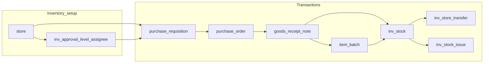

# Inventory transactions and batch flow (Heka)

## When to load this skill

- Adding or changing **purchase requisition**, **purchase order**, **GRN**, **stock**, **transfer**, **issue**, or **approval configuration** behavior.
- Touching **`item_batch`**, **`inv_stock`**, **`goods_receipt_line`**, or **`item_master.is_batch_required`**.
- Writing migrations or seeds that affect inventory tables or **`status_tagging`** IDs for inventory document types.
- Mirroring new **SvelteKit routes** under `home/inventory` or `home/inventory-setup` per project rules.

## Project conventions (do not bypass)

- **Data path**: [`.cursor/rules/remote-api-pages-flow.mdc`](../../rules/remote-api-pages-flow.mdc) — `+page.svelte` → mirrored `+server.ts` → `$lib/server/heka/...` modules; UI types in `$lib/model/type`, not raw Drizzle types in components ([`.cursor/rules/app-development.mdc`](../../rules/app-development.mdc)).
- **AuthZ**: Every server entrypoint uses **`ensureCanAccessHospital`** (or inventory helpers that call it) with `hospital_id` from the route.
- **Workflow states**: Document lifecycle uses **`status_tagging`** + **`status_tagging_type`**, not ad-hoc status tables. Inventory type IDs and per-flow status IDs are mirrored in [`src/lib/model/enum/db-link.ts`](../../../src/lib/model/enum/db-link.ts) (`StatusTaggingTypeEnum`, `InvPrStatusTaggingEnum`, `InvPoStatusTaggingEnum`, `InvGrnStatusTaggingEnum`, etc.). **Any change to seeded IDs requires the same change in `db-link.ts`.**
- **Seeds**: `status_tagging_type` / `status_tagging` extensions live in [`src/lib/server/db/seed/information-table-seed.ts`](../../../src/lib/server/db/seed/information-table-seed.ts).

## End-to-end business flow

1. **Approval configuration** (per hospital + store + module `PR` | `PO`): `inv_approval_level` + `inv_approval_assignee`. Actions logged in `inv_approval_log` (`InvApprovalActionEnum`).
2. **PR**: `purchase_requisition` + lines; approvals advance `current_level` or set final `status_tagging_id`; optional line qty adjustments on approve.
3. **PO**: Either from an **approved** PR (allocates from PR line `qty_remaining`) or **manual** (no PR): `purchase_order` has `store_id` (always) and nullable `pr_id`. PO approval uses `purchase_order.store_id` (not the PR’s store). `createPurchaseOrder` (PR path) and `createPurchaseOrderDirect` in [`po.server.ts`](../../../src/lib/server/heka/inventory/po.server.ts).
4. **GRN**: (a) **PO-backed**: `goods_receipt_note.po_id` set; `supplier_id` denormalized from PO; receipt into the branch **central** store; `goods_receipt_line` ties to `purchase_order_line`. (b) **Direct** (no PO): `po_id` null, `goods_receipt_note.supplier_id` required; `goods_receipt_line.po_line_id` null. Both paths: each line creates/links **`item_batch`**, and **`inv_stock.quantity` is in issue (stock) units** (purchase-line quantities are converted with [`item_unit_master`](../../../src/lib/server/db/table/information-table/information-table.ts) via [`item-unit-inventory.server.ts`](../../../src/lib/server/heka/inventory/item-unit-inventory.server.ts)).
5. **Stock listing**: Aggregates from `inv_stock` (quantities in **issue units**); display joins default `item_unit_master` for the issue unit name. Lot view joins `item_batch`. **FEFO** = order by `item_batch.expiry_date ASC NULLS LAST`.
6. **Transfer**: Lines are **batch-scoped**: `{ itemId, batchId, quantity, unitId }`; moves quantity between stores for the same `batch_id`.
7. **Issue**: Lines may omit **`batchId`** → auto **FEFO** across `inv_stock` rows for that item in the store; or set **`batchId`** for a single-batch deduction. Multiple `inv_stock_issue_line` rows may be inserted when FEFO spans batches.

## Schema locations

| Area | Drizzle file |
|------|----------------|
| PR/PO/GRN, approval, `item_batch`, `inv_stock`, transfer, issue | [`src/lib/server/db/table/information-table/inventory-transaction-table.ts`](../../../src/lib/server/db/table/information-table/inventory-transaction-table.ts) |
| Relations | [`src/lib/server/db/table/information-table/inventory-transaction-relation.ts`](../../../src/lib/server/db/table/information-table/inventory-transaction-relation.ts) |
| `item_master` (incl. `is_batch_required`) | [`src/lib/server/db/table/information-table/information-table.ts`](../../../src/lib/server/db/table/information-table/information-table.ts) |
| Exported from | [`src/lib/server/db/schema.ts`](../../../src/lib/server/db/schema.ts) |

### Normalized batch + stock (critical)

- **`item_batch`**: Master row for a batch **identity**. Uniqueness in the database is enforced with a **unique index** on `(hospital_id, item_id, batch_no, expiry_date, supplier_id, manufacturer_id, purchase_price)` with **`NULLS NOT DISTINCT`** (PostgreSQL **15+**). Different supplier/manufacturer/price can therefore split logically separate batches even with the same printed batch number and expiry.
- **`inv_stock`**: **Quantity per store per batch** (`store_id`, `batch_id`, `quantity`, soft delete). Active rows: partial unique **`(store_id, batch_id) WHERE deleted_at IS NULL`** (see migration).
- **Legacy**: `inv_stock_lot` was **dropped** after migration **`0033_item_batch_normalized_stock.sql`**. Do not reintroduce it; extend `item_batch` / `inv_stock` instead.

### Synthetic “open” batch

- Constant **`__OPEN_STOCK__`** (`OPEN_STOCK_BATCH_NO`) in [`src/lib/server/heka/inventory/item-batch.server.ts`](../../../src/lib/server/heka/inventory/item-batch.server.ts) for items **without** strict batch capture on GRN (when `is_batch_required` is false and line omits a real batch no).

### Item master: `is_batch_required`

- When **true**, GRN **must** supply `batch_no`, `expiry_date`, and `purchase_price` for that item’s line.
- When **false**, GRN may omit them; server uses open batch and PO `unit_price` (or line override) for `purchase_price` where applicable.
- UI: Inventory Setup → Item Master form checkbox; API: `isBatchRequired` on POST/PUT [`item-master/+server.ts`](../../../src/routes/api/(private)/heka/hospital/[hospital_id]/home/inventory-setup/item-master/+server.ts).

## Server modules (under `src/lib/server/heka/inventory/`)

| Module | Role |
|--------|------|
| [`inventory-scope.server.ts`](../../../src/lib/server/heka/inventory/inventory-scope.server.ts) | Hospital access, store-in-hospital, staff id, central store lookup |
| [`approval-config.server.ts`](../../../src/lib/server/heka/inventory/approval-config.server.ts) | CRUD approval levels/assignees |
| [`approval-workflow.server.ts`](../../../src/lib/server/heka/inventory/approval-workflow.server.ts) | Max level, “can this staff approve this level?”, approval logs list |
| [`item-batch.server.ts`](../../../src/lib/server/heka/inventory/item-batch.server.ts) | `findOrCreateItemBatch`, `addDeltaToInvStock` |
| [`item-unit-inventory.server.ts`](../../../src/lib/server/heka/inventory/item-unit-inventory.server.ts) | Purchase → issue unit conversion for `inv_stock` |
| [`pr.server.ts`](../../../src/lib/server/heka/inventory/pr.server.ts) | PR CRUD + approval transitions |
| [`po.server.ts`](../../../src/lib/server/heka/inventory/po.server.ts) | PR-backed + manual PO; approval (by `store_id`) + send to supplier |
| [`grn.server.ts`](../../../src/lib/server/heka/inventory/grn.server.ts) | GRN post (PO or direct): batch resolution, `goods_receipt_line`, `inv_stock` (issue qty), PO line cumulative when `po_id` set |
| [`stock.server.ts`](../../../src/lib/server/heka/inventory/stock.server.ts) | Aggregated and lot listings |
| [`transfer.server.ts`](../../../src/lib/server/heka/inventory/transfer.server.ts) | Batch-wise inter-store moves |
| [`issue.server.ts`](../../../src/lib/server/heka/inventory/issue.server.ts) | FEFO or explicit batch issues |

## HTTP API layout (mirror private routes)

Base: `/api/heka/hospital/{hospital_id}/home/...`

| Area | Example path |
|------|----------------|
| Approval config | `inventory-setup/approval-config` |
| PR | `inventory/purchase-requisition`, `.../approve`, `.../resubmit` |
| PO | `inventory/purchase-order` (POST: PR-backed body, or `mode: "direct"` with `storeId` + free lines) |
| GRN | `inventory/grn` (POST: `poId` + lines for PO path, or `mode: "direct"` with `storeId`, `supplierId`, `lines` with `itemId`, `unitId`, `receivedQty`, batch fields) |
| Stock | `inventory/stock?mode=aggregated|lots` |
| Transfer | `inventory/transfer` (lines: `itemId`, `batchId`, `quantity`, `unitId`) |
| Issue | `inventory/issue` (lines: `itemId`, `qty`, `unitId`, optional `batchId`) |

## Migrations (order)

1. **`drizzle/0032_inventory_transactions.sql`**: Core inventory tables (before batch normalization), `store.is_central_store`, etc.
2. **`drizzle/0033_item_batch_normalized_stock.sql`**: `item_batch`, `inv_stock`, `item_master.is_batch_required`, GRN line `batch_id`/`purchase_price`, migrate off `inv_stock_lot`, transfer/issue `batch_id`, drop `inv_stock_lot`.
3. **`drizzle/0037_inventory_po_grn_destock_units.sql`**: `purchase_order.store_id` + nullable `pr_id`; `goods_receipt_note` nullable `po_id`, `supplier_id`, nullable `goods_receipt_line.po_line_id`; one-time `inv_stock` quantity conversion using default `item_unit_master`.

## Manual QA reference

- [`docs/inventory-transactions-test-cases.md`](../../../docs/inventory-transactions-test-cases.md)

## Common pitfalls

- **Do not** use magic `status_tagging` numeric literals in new code without aligning to [`db-link.ts`](../../../src/lib/model/enum/db-link.ts).
- **GRN store**: Must be the branch **central** store (enforced in `grn.server.ts`).
- **Transfer/issue**: Lines reference **`item_batch.id`**, not old lot ids; validate `item_batch` belongs to hospital and matches `itemId`.
- **Concurrent stock**: Use transactions (already wrapped in post handlers) when updating `inv_stock` and documents together.
