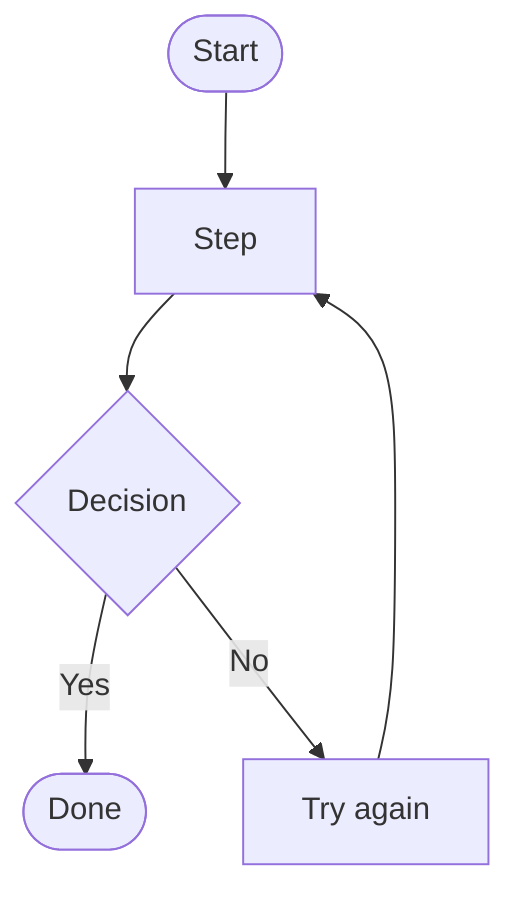
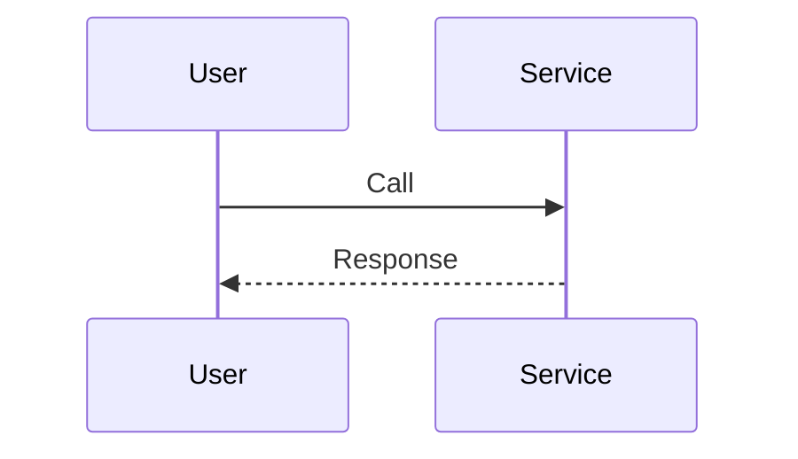
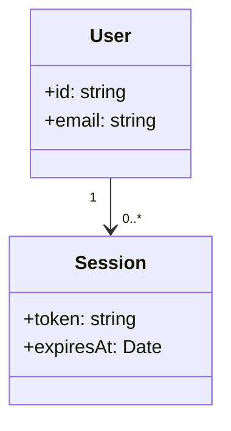
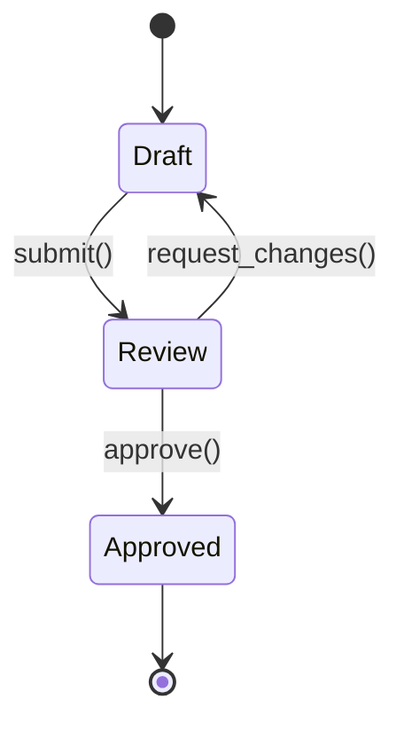
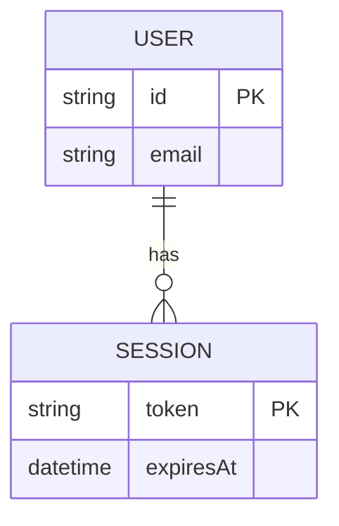
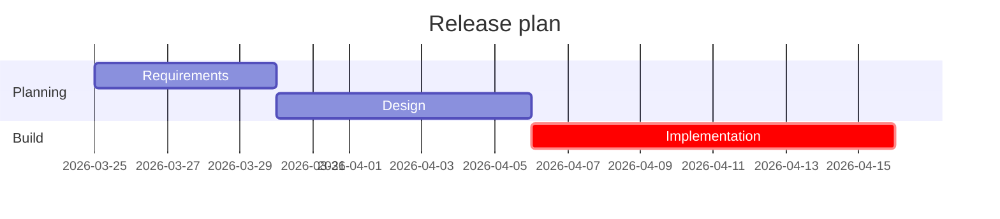
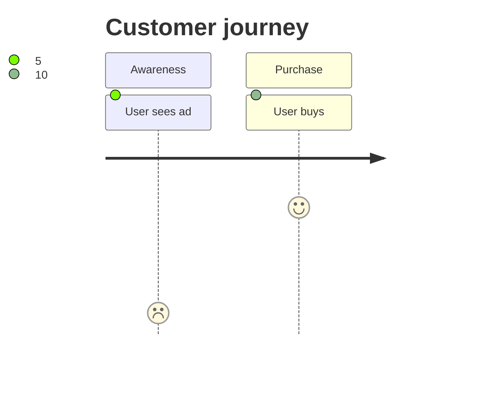

# Mermaid Diagram Maker

## What this skill does

- Converts a user’s diagram intent into valid **Mermaid** syntax.
- Chooses an appropriate Mermaid diagram type (flowchart/sequence/class/state/ER/Gantt/etc.) based on what the user is describing.
- Produces a complete, copy-pastable Mermaid block in the requested style (labels, direction, grouping, and simple theming).

## How the agent should respond (workflow)

1. **Identify the diagram type**
   - Logic/process/steps → `flowchart`
   - Time-ordered interactions/messages → `sequenceDiagram`
   - Data model (entities/classes) → `classDiagram` or `erDiagram`
   - Object lifecycle / states / transitions → `stateDiagram` (prefer `stateDiagram-v2`)
   - Timeline dependencies → `gantt`
   - End-to-end user journeys → `journey`

2. **Extract the minimum required parts**
   - Flowchart: nodes + edges + (optional) decision branches + direction (`TD`/`LR`)
   - Sequence: participants + message order + (optional) return messages
   - Class/ER: entities/classes + attributes/relationships + cardinality (ER)
   - State: states + transitions + triggers/events + (optional) final state
   - Gantt: sections/tasks + start/duration + dependencies (if provided)

3. **Handle missing details with smart defaults**
   - If direction is unclear, default flowchart direction to `TD`.
   - If grouping is unclear, avoid `subgraph` unless the user mentions modules/areas/components.
   - If styling is not requested, keep it default (no custom theme blocks).

4. **Build the Mermaid code**
   - Use the diagram’s correct header keyword (e.g. `flowchart TD`, `sequenceDiagram`).
   - Ensure every node/participant referenced in links/messages is defined.
   - Prefer simple, explicit labels (avoid overly long text in node IDs).

5. **Return output in a predictable format**
   - Always include **one** fenced code block with ` ```mermaid `.
   - Follow it with a short “assumptions” note if you had to infer anything (max 3 bullets).

## Documentation entry points

- Mermaid overview: `https://mermaid.js.org/`
- Live editor / syntax testing: `https://mermaid.live/`
- Syntax by diagram type (entry pages): `https://mermaid.js.org/syntax/`

## Mermaid syntax templates the agent can adapt

### Flowchart template (`flowchart`)

Use when the user describes steps, decisions, or a pipeline.



### Sequence template (`sequenceDiagram`)

Use when the user describes request/response or message flow over time.



### Class template (`classDiagram`)

Use when the user describes types/classes and relationships.



### State template (`stateDiagram-v2`)

Use when the user describes states and transitions.



### ER template (`erDiagram`)

Use when the user describes database tables and relationships.



### Gantt template (`gantt`)

Use when the user asks for a timeline with tasks.



### Journey template (`journey`)

Use when the user wants a journey mapped across touchpoints.



## Quality checklist (verify before answering)

- **Valid diagram header** for the chosen diagram type.
- All **nodes/participants** referenced in links/messages are declared.
- Flowchart: every branching edge has a label if it represents a condition.
- State diagram: transitions include the trigger label (when provided).
- Output includes exactly one ` ```mermaid ` block.
