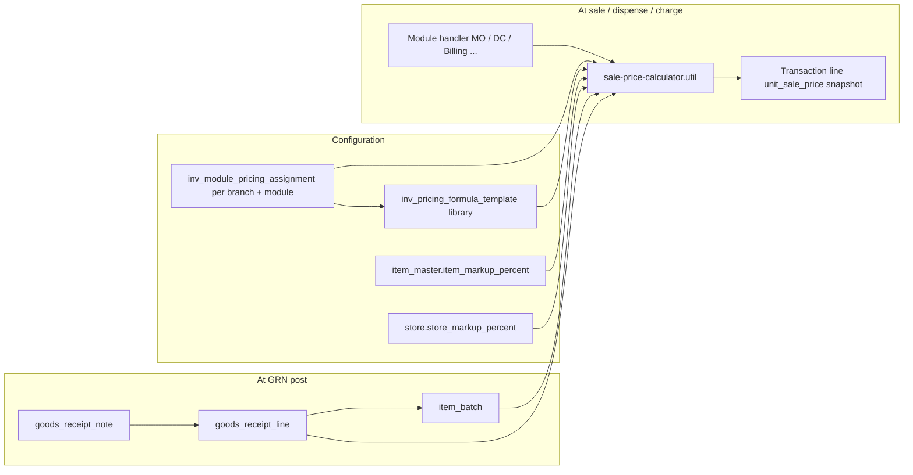

# GRN & Sale Pricing Refactor — Step-by-Step Plan

## Goal

Stop persisting **sale price** and **employee sale price** at receipt time (GRN / `item_batch`). Store only **cost inputs** (purchase price, discount, tax, free qty, batch identity) and **provenance** (`goods_receipt_line_id`, `goods_receipt_note_id` on `item_batch`). Compute sale prices **only when an item is sold** using a **template library** + **per-scope assignment** (one assigned template per `hospital + branch + module`), with **three distinct markups** (each its own formula slot — never merged):

| Markup | Scope | Where it lives | Position in formula |
|--------|-------|----------------|---------------------|
| **More Sale Less (MSL) markup** | Per template | `inv_pricing_formula_template.msl_markup_percent` | **MSL slot** |
| **Item markup** | Per `item_master` | `item_master.item_markup_percent` | **ITEM slot** |
| **Store markup** | Per `store` | `store.store_markup_percent` | **STORE slot** |

**Template library:** hospitals create **unlimited named templates** (reusable formula definitions). Each `(branch, module)` **assigns exactly one** template. At sale time the engine resolves: assignment → template → calculator (plus item + store markups).

Remove all sale-price **input fields** and **preview** from GRN UI. Remove GRN-time `computeGrnLinePrices` → `item_batch.sale_price` / `emp_sale_price` writes.

---

## Current State (baseline)


| Area                        | Today                                                                                                                                       |
| --------------------------- | ------------------------------------------------------------------------------------------------------------------------------------------- |
| `inv_branch_pricing_config` | Per **branch** only; sale/emp rules + `%` markups; `saleManualOnGrnLine` / `empManualOnGrnLine`                                             |
| `grn-pricing.util.ts`       | `computeLandedCostTotals`, `computeCostPerUnit`, `computeGrnLinePrices` — runs at **GRN post**                                              |
| `goods_receipt_line`        | `purchase_price`, discount/tax, `**sale_price`**, `**emp_sale_price**`                                                                      |
| `item_batch`                | `purchase_price`, `**sale_price**`, `**emp_sale_price**`; identity unique on `(hospital, item, batch_no, expiry, supplier, purchase_price)` |
| `item_master`               | **No markup field**                                                                                                                         |
| `store`                     | **No markup field** (`branch_id`, `store_name`, … only)                                                                                     |
| GRN UI                      | `GrnLineReceiptFields.svelte` — sale/emp override inputs + auto preview                                                                     |
| Stock / batch pick UIs      | Show `salePrice` / `empSalePrice` from `item_batch`                                                                                         |
| Medication order            | `unit_sale_price` on line; default from batch `sale_price` via allocations                                                                  |
| Department consumption      | Snapshots `emp_sale_price` from `item_batch` at post                                                                                        |


---

## Target Architecture




**Principles**

1. **GRN stores cost facts only** — no derived sale prices.
2. `**item_batch` links to source GRN** — enables formula to read line-level discount/tax/free qty at sale time.
3. **Formula is evaluated at sale time** — result is snapshotted on the **sale transaction line** (already pattern: `medication_order_line.unit_sale_price`, `inv_department_consumption_line.emp_sale_price`).
4. **Template library + assignment** — formula **definition** lives in templates (limitless per hospital); **one template assigned** per `(hospital, branch, module)`. Sale time never picks among templates — only loads the assigned one.
5. **MSL, item, and store markups are separate formula slots** — MSL from template; item/store from masters. Store markup from the **transaction store**.

---

## Phase 1 — Schema & migrations

### Step 1.1 — `item_batch`: GRN provenance

**Migration `0082_item_batch_grn_provenance.sql`**

```sql
ALTER TABLE item_batch
  ADD COLUMN goods_receipt_note_id uuid REFERENCES goods_receipt_note(id) ON DELETE SET NULL,
  ADD COLUMN goods_receipt_line_id integer REFERENCES goods_receipt_line(id) ON DELETE SET NULL;

CREATE INDEX item_batch_grn_line_idx ON item_batch (goods_receipt_line_id);
CREATE INDEX item_batch_grn_note_idx ON item_batch (goods_receipt_note_id);
```

- Update Drizzle: `inventory-transaction-table.ts` + relations.
- `**findOrCreateItemBatch**`: accept optional `grnId` / `grnLineId`; set on insert (do not use for identity match — batch identity stays batch_no + expiry + supplier + purchase_price).
- **Backfill** (one-time): join `goods_receipt_line.batch_id` → set `item_batch.goods_receipt_line_id` and `goods_receipt_note_id` from `grn_id`.

### Step 1.2 — `item_master`: item markup

**Migration `0083_item_master_markup.sql`**

```sql
ALTER TABLE item_master
  ADD COLUMN item_markup_percent numeric(8, 2) NOT NULL DEFAULT '0';
```

- UI: Item Master create/edit — optional `%` field (Paraglide keys).
- API + server modules for item master CRUD.

### Step 1.3 — `store`: store markup

**Migration `0084_store_markup.sql`**

```sql
ALTER TABLE store
  ADD COLUMN store_markup_percent numeric(8, 2) NOT NULL DEFAULT '0';
```

- Drizzle: `storeTable` in `information-table.ts`.
- UI: **Inventory Setup → Stores** — `StoreFormModal.svelte` — optional **Store markup %** field.
- API: `inventory-setup/stores/+server.ts` + `$lib/server/heka/administration/store.server.ts` — read/write `storeMarkupPercent`.
- Model type: extend store DTO in `$lib/model/type/`** (not Drizzle in UI).
- **Sale-time source:** pass `storeId` into `computeSalePriceAtTransaction` (the store stock is issued from / sale is recorded against). Default `0` when store has no override.

**Rationale:** Different stores under the same branch can apply different retail markups; templates stay shared across stores via assignment, not per-store formula rows.

### Step 1.4 — Template library + module assignment (replace `inv_branch_pricing_config`)

**Migration `0085_inv_pricing_formula_template.sql`**

Two tables: **templates** (many per hospital) and **assignments** (one per branch + module).

#### Table A — `inv_pricing_formula_template` (library)

| Column | Purpose |
|--------|---------|
| `id` | serial PK |
| `hospital_id` | FK |
| `name` | varchar — display name, **unique per hospital** |
| `description` | text, optional |
| `formula_version` | int — engine version for migrations |
| `sale_include_discount` | bool |
| `sale_include_tax` | bool |
| `sale_include_free_qty` | bool — free qty in cost denominator |
| `msl_markup_percent` | numeric — **More Sale Less** markup |
| `slot_order` | jsonb or text — v1 default `["COST","MSL","ITEM","STORE"]` |
| `emp_use_percent_of_sale` | bool |
| `emp_percent_of_sale` | numeric |
| `emp_include_discount` | bool — when emp path is separate cost (not % of sale) |
| `emp_include_tax` | bool |
| `emp_include_free_qty` | bool |
| `is_system_default` | bool — seeded template, non-deletable or rename-only |
| `status_id` | active/inactive |
| timestamps | |

**Indexes:** `(hospital_id)`, unique `(hospital_id, name)`.

**Rules:**

- **Limitless** templates per hospital (no cap).
- Create, edit, duplicate, deactivate templates independently of assignments.
- **Delete:** block if any `inv_module_pricing_assignment` references the template (or soft-delete + `status_id` inactive).
- **Seed** on hospital setup (optional): one template `"Standard"` with sensible defaults; hospitals clone/extend from there.

#### Table B — `inv_module_pricing_assignment` (scope → template)

| Column | Purpose |
|--------|---------|
| `id` | serial PK |
| `hospital_id` | FK |
| `branch_id` | FK |
| `module` | `MO` \| `DC` \| `BILLING` \| … (sale/charge modules) |
| `formula_template_id` | FK → `inv_pricing_formula_template` ON DELETE RESTRICT |
| timestamps | |

**Unique index:** `(hospital_id, branch_id, module)` — **exactly one assigned template per scope**.

**Deprecate / drop `inv_branch_pricing_config`:**

- Migrate existing branch rows into a default template + per-branch assignments (data migration in same migration or follow-up script).
- Drop `sale_manual_on_grn_line`, `emp_manual_on_grn_line`, old markup columns, then drop table when unused.

#### Sale-time resolution

```text
storeId → store.branch_id
→ SELECT formula_template_id
    FROM inv_module_pricing_assignment
    WHERE hospital_id AND branch_id AND module
→ SELECT * FROM inv_pricing_formula_template WHERE id = formula_template_id
→ sale-price-calculator.util ( + item_markup + store_markup )
```

If **no assignment** for scope: fail with clear error (or fall back to hospital `is_system_default` template only if product accepts implicit default — prefer explicit assignment in UI).

### Template library model (chosen)

| Concept | Behavior |
|---------|----------|
| **Templates** | Unlimited per hospital; named, reusable formula definitions |
| **Assignment** | One template per `(hospital, branch, module)` |
| **At sale time** | Assignment → template (deterministic, no runtime template pick) |
| **Changing pricing** | Edit template (affects all scopes using it) **or** reassign scope to another template |
| **Not in scope** | Multiple templates per transaction; category/store-type auto-pick without assignment |

```text
Example:
  Template "Standard pharmacy"     → Branch A + MO, Branch B + MO
  Template "Employee ward pricing" → Branch A + DC
  Template "Campaign Q3"           → Branch C + MO (swap assignment when campaign ends)
```

### Step 1.5 — Remove sale columns (deferred drop)

Do **not** drop in first deploy — nullable + stop writing first.


| Table                | Columns to stop writing, then drop |
| -------------------- | ---------------------------------- |
| `item_batch`         | `sale_price`, `emp_sale_price`     |
| `goods_receipt_line` | `sale_price`, `emp_sale_price`     |


Migration `0086_drop_presale_price_columns.sql` after all readers migrated.

---

## Phase 2 — Formula engine (server + shared util)

### Step 2.1 — Define formula contract

**File:** `$lib/model/type/heka/sale-price-formula.type.ts`

```ts
// Inputs available at sale time (all optional except module + branch + batch)
type SalePriceFormulaInput = {
  module: InvPricingModuleCode;
  branchId: string;
  storeId: number;
  itemId: number;
  batchId: number;
  // From goods_receipt_line (via item_batch.goods_receipt_line_id)
  receivedQty: number;
  freeQty: number;
  purchaseUnitPrice: number;
  discountAmount: number;
  discountPercent: number;
  taxAmount: number;
  taxPercent: number;
  // From item_master
  itemMarkupPercent: number;
  // From store (selling / issuing store)
  storeMarkupPercent: number;
  // From inv_pricing_formula_template (via assignment)
  template: PricingFormulaTemplateDto;
  mslMarkupPercent: number;       // from template
  costBasisFlags: CostBasisFlags; // from template
  empUsePercentOfSale: boolean;
  empPercentOfSale: number;
};

type SalePriceFormulaResult = {
  unitSalePriceIssue: string;   // per issue unit
  unitEmpSalePriceIssue: string;
};
```

### Step 2.2 — Implement calculator

**File:** `$lib/tool/inventory/sale-price-calculator.util.ts`

1. `**computeCostPerIssueUnit(input)`** — reuse landed-cost logic from `grn-pricing.util.ts` but:
  - Read GRN line fields (not overrides).
  - Output **cost per issue unit** (convert purchase → issue via IUM).
  - **Do not apply any markup here** unless formula slot says so.
2. `**applyFormulaSlot(base, slot, markupPercent)`** — slots:
  - `COST` — raw cost per issue unit
  - `MSL` — `base * (1 + mslMarkupPercent/100)` — **MSL position**
  - `ITEM` — `base * (1 + itemMarkupPercent/100)` — **item markup position**
  - `STORE` — `base * (1 + storeMarkupPercent/100)` — **store markup position**
3. **Default formula order** (documented, overridable later):
  ```
   cost = landedCostPerIssueUnit(flags, grnLine)
   afterMsl = cost * (1 + mslMarkupPercent/100)
   afterItem = afterMsl * (1 + itemMarkupPercent/100)
   salePrice = afterItem * (1 + storeMarkupPercent/100)
   empSalePrice = empUsePercentOfSale ? salePrice * (empPercentOfSale/100) : <emp cost path with same slots>
  ```
   Slot order is configurable per module in v2; v1 uses fixed **COST → MSL → ITEM → STORE**.
4. **Remove** `computeGrnLinePrices` sale/emp outputs from GRN path; keep `computeLandedCostTotals` only if needed for reports (or move to calculator).

**Server:** `$lib/server/heka/inventory/sale-price.server.ts`

- `listPricingFormulaTemplates(hospitalId)`
- `getPricingFormulaTemplate(id)` / `create` / `update` / `duplicate` / `deactivate`
- `getModulePricingAssignment(hospitalId, branchId, module)` / `upsertModulePricingAssignment`
- `resolveTemplateForSale(hospitalId, branchId, module)` — assignment → template (throws if missing)
- `computeSalePriceAtTransaction(event, { batchId, itemId, storeId, module })` — loads batch → GRN line → item → store → **resolved template** → util.

### Step 2.3 — Store & branch resolution

- **`storeId`** is required at sale time (dispensing store, consumption From store, billing store).
- Resolve **`branchId`** from `store.branch_id`.
- Load **`inv_module_pricing_assignment`** then **`inv_pricing_formula_template`**.
- Load `store.store_markup_percent` for the **STORE** slot.

---

## Phase 3 — GRN: remove sale price from inputs & post

### Step 3.1 — Server: `grn.server.ts`

- Remove `computeGrnLinePrices` calls.
- Remove `salePriceOverride` / `empSalePriceOverride` from input types.
- On post:
  - Insert `goods_receipt_line` with **cost fields only** (no `sale_price` / `emp_sale_price`).
  - `findOrCreateItemBatch` → pass `grnId`, `grnLineId` after line insert.
  - **Do not** `UPDATE item_batch SET sale_price, emp_sale_price`.
- Keep `purchase_price` on line + batch (issue-unit normalized as today).

### Step 3.2 — API: `inventory/grn/+server.ts`

- Drop `salePriceOverride`, `empSalePriceOverride` from POST body parsing.

### Step 3.3 — UI: GRN new / edit


| File                          | Change                                                                                  |
| ----------------------------- | --------------------------------------------------------------------------------------- |
| `grn/new/+page.svelte`        | Remove sale/emp fields from draft line type and submit payload                          |
| `GrnLineReceiptFields.svelte` | Remove sale/emp inputs, overrides, `computeGrnLinePricesPreview`, pricing preview block |
| `grn/[grn_id]/+page.svelte`   | Ensure detail does not show sale columns (already mostly cost-only)                     |


### Step 3.4 — Delete / slim GRN-only pricing preview

- `grn-pricing-preview.util.ts` — remove or restrict to **admin formula tester** only (optional).
- `grn-pricing.util.ts` — delete `computeGrnLinePrices`; keep landed-cost helpers if shared.

---

## Phase 4 — Pricing UI (template library + assignment)

Split into **two areas** under Inventory Setup (can be tabs on one page or sibling routes).

### Step 4.1 — Template library page

**Route:** `inventory-setup/pricing-formula-templates` (or tab **Templates** on pricing config)

- List all templates for hospital (name, MSL %, usage count / assigned scopes).
- **Create / edit template** modal:
  - Name, description
  - Cost basis toggles (discount, tax, free qty in denominator)
  - **MSL markup %**
  - Slot order (read-only v1: COST → MSL → ITEM → STORE)
  - Employee path: percent-of-sale vs separate cost flags
  - **Live preview** with sample batch + sample store + sample item (via preview API)
- **Duplicate template** — clone row with `"Copy of {name}"`.
- **Deactivate** — if assigned, warn which branch+module pairs use it.
- **Delete** — only when zero assignments (RESTRICT FK).

**Store markup** and **item markup** are not on this page — preview API accepts optional `storeId` / `itemId` for indicative output.

### Step 4.2 — Module assignment page

**Route:** `inventory-setup/pricing-config` (existing path, re-scoped)

- Branch selector (navbar branch or picker when “All branches”).
- Module tabs: `MO`, `DC`, `BILLING`, …
- Per scope: **SearchSelect** of active templates (from library).
- Show read-only summary of selected template (MSL %, cost flags, emp path).
- Link **“Edit template”** → opens library editor for that template id.
- Unassigned scope: prominent warning — sales for that module on that branch will fail until assigned.

### Step 4.3 — API

| Endpoint | Purpose |
|----------|---------|
| `GET/POST /inventory-setup/pricing-formula-templates` | List / create templates |
| `GET/PUT/DELETE /inventory-setup/pricing-formula-templates?id=` | CRUD one template |
| `POST .../pricing-formula-templates?action=duplicate&id=` | Clone template |
| `GET/PUT /inventory-setup/pricing-config?branchId=&module=` | Get / set assignment (`formulaTemplateId`) |
| `POST /inventory-setup/pricing-config?action=preview` | Sale price preview (templateId or branch+module, batchId, storeId, itemId) |

Replace `upsertBranchPricingConfig` / `grn-pricing.server.ts` branch config with `pricing-formula-template.server.ts` + `pricing-formula-assignment.server.ts`.

### Step 4.4 — Paraglide

- Template library: `inv_pricing_template_*` (name, duplicate, in_use_warning, assigned_count, …)
- Assignment: `inv_pricing_assignment_*`, `inv_pricing_config_msl_markup`, `inv_pricing_config_item_markup_help`, `inv_pricing_config_store_markup_help`, `inv_store_markup_percent`, module labels.

---

## Phase 5 — Sale-time consumers (compute + snapshot)

Each module that charges a price must call `computeSalePriceAtTransaction` when posting, then snapshot on the line.

### Step 5.1 — Medication order (dispense)


| File                                    | Change                                                                                                          |
| --------------------------------------- | --------------------------------------------------------------------------------------------------------------- |
| `medication-order-dispense.server.ts`   | On save/post: for each allocation, `unitSalePrice = computeSalePrice(..., module: 'MO', storeId)`               |
| `MedicationOrderInventoryFields.svelte` | Show **computed preview** (read-only) when batch selected; remove editable default from `item_batch.sale_price` |
| `med-order-line-inventory.util.ts`      | `defaultUnitSalePriceFromAllocations` → call preview API or remove client default                               |


### Step 5.2 — Department consumption


| File                                  | Change                                                                                                                                         |
| ------------------------------------- | ---------------------------------------------------------------------------------------------------------------------------------------------- |
| `department-consumption.server.ts`    | At post: `empSalePrice = computeSalePrice(..., module: 'DC', storeId: consumption.store_id).unitEmpSalePriceIssue` — **not** from `item_batch` |
| `ConsumptionLineDialogContent.svelte` | Remove sale/emp columns from batch table (or show computed preview via API)                                                                    |


### Step 5.3 — Department issue / stock issue

- If these modules gain charging later, use module code `DISS` / `RFS` with own **assignment** + template.
- Until then: remove `salePrice` display from `InventoryBatchQtyPickTable` when not a sale module.

### Step 5.4 — OP billing / inventory billing lines

- When billing pulls inventory items, use `module: 'BILLING'` formula at invoice line creation.
- Snapshot on `op_billing_line` (or existing price field).

### Step 5.5 — Stock list & reports


| File                            | Change                                                                                                       |
| ------------------------------- | ------------------------------------------------------------------------------------------------------------ |
| `stock/+page.svelte`            | Remove sale/emp columns **or** replace with **“Indicative price”** from on-demand API (computed, not stored) |
| `stock/+server.ts`              | Stop returning `batch.salePrice` / `empSalePrice`                                                            |
| `stock-reports.server.ts`       | Compute at report time or drop price columns until sale module provides snapshots                            |
| `reports/movement/+page.svelte` | Align with stock list                                                                                        |


**Optional:** `GET /inventory/stock?mode=lots&includeIndicativePrice=1` — server-side preview using `MO` or `GRN` module formula (clearly labeled non-binding).

---

## Phase 6 — `item_batch` identity & GRN link validation

### Step 6.1 — Post order fix

Today: batch created → GRN line inserted with `batch_id`.  
Target: insert GRN line → create/link batch with `goods_receipt_line_id` set.

Refactor `grn.server.ts` transaction:

1. Insert `goods_receipt_line` (batch_id nullable initially **or** insert batch first with null line id then update both — prefer single direction).
2. Recommended: create batch with `grn_line_id` after line insert in same tx:
  ```text
   insert grn_line (batch_id null)
   → findOrCreateItemBatch(..., grnLineId, grnId)
   → update grn_line.batch_id
  ```

### Step 6.2 — Validation

- Every batch created from GRN must have non-null `goods_receipt_line_id` + `goods_receipt_note_id`.
- Direct stock adjustments (if any) may leave null provenance.

---

## Phase 7 — Cleanup & deprecation

1. Drop columns: `item_batch.sale_price`, `item_batch.emp_sale_price`, `goods_receipt_line.sale_price`, `goods_receipt_line.emp_sale_price`.
2. Drop `inv_branch_pricing_config` after data migrated to templates + assignments.
3. Delete `grn-pricing.server.ts` branch-config helpers; remove `computeGrnLinePrices` from GRN flow.
4. Update skill: `.cursor/skills/inventory-transactions-and-batch-flow/SKILL.md`.
5. Update `docs/inventory-transactions-test-cases.md`.

---

## Phase 8 — Testing checklist

### GRN

- [ ] PO-backed GRN: no sale/emp inputs; post succeeds; `item_batch` has `goods_receipt_*_id`.
- [ ] Direct GRN: same.
- [ ] `item_batch` identity unchanged for same batch_no/expiry/supplier/purchase_price.
- [ ] `goods_receipt_line` has no sale columns populated.

### Formula config — template library

- [ ] Create unlimited templates with unique names per hospital.
- [ ] Duplicate template copies all formula fields.
- [ ] Cannot delete template referenced by an assignment.
- [ ] Edit template MSL % → preview updates; all assigned scopes use new values on next sale.
- [ ] Assign template to branch + module; reassign to different template changes resolved formula.
- [ ] Unassigned scope → sale-time error (or documented fallback).
- [ ] MSL / item / store markups affect preview independently.

### Store master

- [ ] Create/edit store with `store_markup_percent`; persists and reloads.
- [ ] Store with `0` markup does not alter formula result.

### Sale modules

- [ ] Medication order dispense: `unit_sale_price` snapshotted at post; stock deducted.
- [ ] Department consumption: `emp_sale_price` snapshotted at post from formula, not batch.
- [ ] Re-post / idempotency: price snapshot stable for same inputs.

### UI boundary

- [ ] `pnpm run check:ui-boundary` — no `$lib/server` in UI; preview via API only.

### Regression

- [ ] FEFO batch pick still works without sale price column.
- [ ] Stock movement reports without stale batch sale prices.

---

## Suggested implementation order (sprints)


| Sprint | Deliverable                                                                                                                    |
| ------ | ------------------------------------------------------------------------------------------------------------------------------ |
| **S1** | Migrations 0082–0084; `item_batch` provenance in `grn.server.ts`; item markup on item master; **store markup on store master** |
| **S2** | `inv_pricing_formula_template` + `inv_module_pricing_assignment` migrations; calculator util; **template library UI** + **assignment UI** + APIs; migrate `inv_branch_pricing_config` data |
| **S3** | GRN UI/server strip sale inputs & GRN-time price writes                                                                        |
| **S4** | Medication order + department consumption sale-time compute                                                                    |
| **S5** | Stock/reports cleanup; drop deprecated columns (0086)                                                                          |


---

## Open decisions (confirm before S2)

1. **Module list** — Which modules get an assignment row on day one? (`MO`, `DC`, `BILLING` minimum?)
2. ~~**Formula / template model**~~ — **Resolved:** template library (limitless per hospital) + one assignment per `(hospital, branch, module)`; fixed slot order v1 (MSL → Item → Store).
3. **Indicative stock price** — Hide completely vs optional API preview on stock lots page?
4. **Employee price** — Always derived from sale price % or independent second cost path in template?
5. **Historical data** — Backfill `goods_receipt_*_id` only; leave old `item_batch.sale_price` until column drop?
6. **Default template** — Seed `"Standard"` per hospital on first visit vs empty library until user creates one?

---

## Files touched (reference)


| Layer  | Files                                                                                                                                                                                                                |
| ------ | -------------------------------------------------------------------------------------------------------------------------------------------------------------------------------------------------------------------- |
| Schema | `inventory-transaction-table.ts`, `information-table.ts`, `inventory-transaction-relation.ts`, `drizzle/0082–0086` |
| Server | `grn.server.ts`, `item-batch.server.ts`, `sale-price.server.ts`, `pricing-formula-template.server.ts`, `pricing-formula-assignment.server.ts`, `store.server.ts`, `department-consumption.server.ts`, `medication-order-dispense.server.ts`, `stock.server.ts` |
| Util | `sale-price-calculator.util.ts`, slim `grn-pricing.util.ts` |
| Types | `sale-price-formula.type.ts`, `pricing-formula-template.type.ts` |
| API | `inventory/grn/+server.ts`, `inventory-setup/pricing-formula-templates/+server.ts`, `inventory-setup/pricing-config/+server.ts`, preview endpoint |
| UI | `GrnLineReceiptFields.svelte`, `grn/new/+page.svelte`, `pricing-formula-templates/+page.svelte`, `pricing-config/+page.svelte`, `StoreFormModal.svelte`, item master pages, med order / DC dialogs |
| i18n   | `messages/en.json` (+ `npm run paraglide`)                                                                                                                                                                           |


